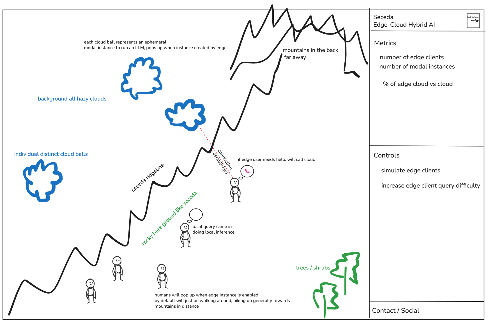
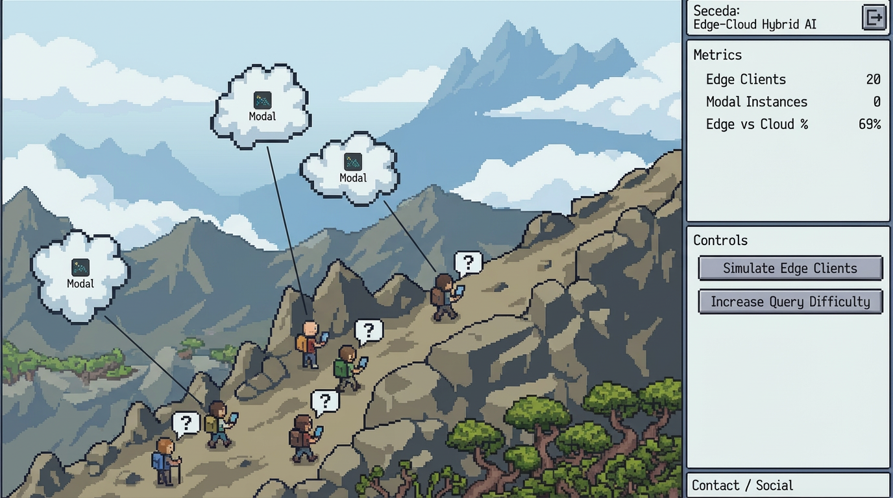
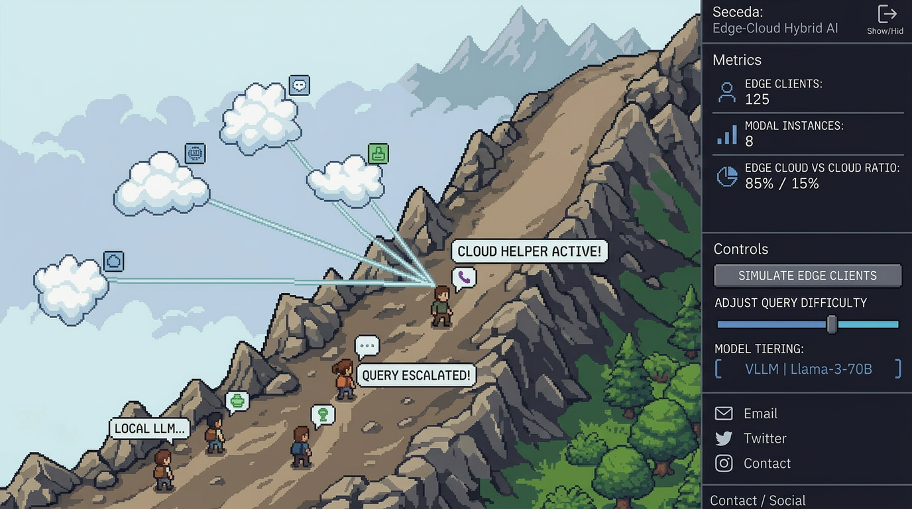

# Demo Dashboard Design

## Sample mockups

  
  
  

## 0. **Backdrop**
Seceda hiking ridgeline with clouds just off the ridgeline, mountain in the background

## 1. **Characters & Roles**

- **Edge devices → Pixel humans**
  - Each edge device is represented as a cute little pixel-human character
  - **Idle state**: standing, relaxed, slowly moving towards the mountains in the backdrop
  - **Thinking state**: has a **thought bubble** (“💭 …thinking…”) while `llamacpp` runs the query locally
  - **Fail / low-confidence state**: sad / frustrated face → shows the decision to escalate

- **Cloud ephemeral LLM → Cloud God**
  - Big, majestic pixel cloud figure floating above the dashboard
  - Receives “phone call” from sad human
  - Answers with **magic beam / message** back to the human

---

## 2. **Animated Flow**

1. **Query arrives** → question mark icon appears above a human
2. **Local SLM thinking** → human shows “thinking” animation
3. **Check confidence**:
   - ✅ If confident → human gives a happy “answer” bubble
   - ❌ If low confidence → human looks sad, shows phone icon
4. **Call cloud** → animated line / beam from human → cloud, where a dedicated cloud ball appears for this human
5. **Cloud answers** → magic beam returns answer to human → human becomes happy again --> cloud ball disappears

**Extra gamification cues**:

- Happy human → green glow
- Sad human → red glow

---

## 3. **Interactive Dashboard Elements**

- **Left canvas**: animated humans + cloud + queries
- **Sidebar**
  optional open / hide for more techy viewers
  - metrics per human / cloud instance
  - **Controls**:
    - “Send hard query” → intentionally triggers cloud call
    - “Turn off local SLM” → humans immediately call cloud god
    - “Load test mode” → lots of humans processing queries at once

## Frameworks / Tools
- PixiJS / Phaser
- https://x.com/chongdashu/status/2014809078757818773
- https://news.ycombinator.com/item?id=47034752
- https://mordenstar.com/other/nb-sprites/
- https://chatgpt.com/share/69b3ce3b-7068-800b-8b60-c2b8a70cbb11
- https://chroma-dave.itch.io/pixelart-hiker
- https://sscary.itch.io/the-adventurer-male
- https://sscary.itch.io/the-adventurer-female
- https://liberatedpixelcup.github.io/Universal-LPC-Spritesheet-Character-Generator/#sex=male&body=Body_Color_light&head=Human_Male_light&expression=Neutral_light&backpack=Backpack_blue&hair=Messy1_black&clothes=Shortsleeve_green&legs=Long_Pants_charcoal&backpack_straps=Straps_blue&shoes=Revised_Boots_black

## Landing page
- With a slide button to select simulated, or live, then a enter button below.
- will show seceda logo, description of this project, links to code etc.
- for simulated - it will be an interactive prerecorded version of the live demo, showing the intended functionality.
- for live, it will be gated behind some simple password check to prevent abuse (potential upgrade to proper, but also simple auth - only I the dev will use this anyways.)
