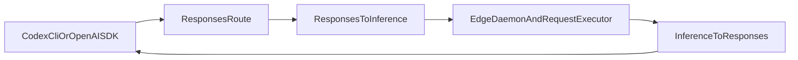

# Responses API Support Plan

## What I found

- `[seceda_edge/cpp/apps/seceda_edge_daemon/main.cpp](seceda_edge/cpp/apps/seceda_edge_daemon/main.cpp)` only wires `POST /v1/chat/completions` and `GET /v1/models`; there is no `/v1/responses` route today.
- `[seceda_edge/cpp/src/openai_compat/openai_parse.cpp](seceda_edge/cpp/src/openai_compat/openai_parse.cpp)` is chat-only. It defaults missing `model` even though `[build/openapi.with-code-samples.yml](build/openapi.with-code-samples.yml)` marks `model` and `messages` as required for chat, and it only accepts text / `input_text` content parts.
- `[seceda_edge/cpp/src/openai_compat/openai_wire.cpp](seceda_edge/cpp/src/openai_compat/openai_wire.cpp)` is a minimal chat adapter. The happy path works, but it omits spec-required `choices[].logprobs: null` and `message.refusal: null`, does not emit `annotations: []`, and defaults `finish_reason` to `"stop"` even when the assistant only produced tool calls.
- The vendored spec in `[build/openapi.with-code-samples.yml](build/openapi.with-code-samples.yml)` defines a different contract for Responses: `input` / `instructions` in, `response` objects and `response.*` SSE events out.
- `[thirdparty/llama.cpp/tools/server/server-common.cpp](thirdparty/llama.cpp/tools/server/server-common.cpp)` and `[thirdparty/llama.cpp/tools/server/server-task.cpp](thirdparty/llama.cpp/tools/server/server-task.cpp)` show the right high-level strategy for Codex compatibility: convert Responses requests to chat-completions messages, reuse the existing completion pipeline, then wrap results back into Responses JSON/SSE. Seceda should borrow that strategy, but follow the vendored OpenAPI spec more closely for required event fields.

## Proposed Scope

- Target a Codex-compatible, stateless first pass of `POST /v1/responses` on top of the existing chat-shaped runtime.
- Do not add `GET/DELETE /v1/responses/{id}`, `/cancel`, `/input_items`, `/compact`, or `/input_tokens` in the first merge unless a harness proves they are required.
- Accept the text and function-calling subset first; return OpenAI-style `invalid_request_error` for `previous_response_id`, `conversation`, `background`, and multimodal `input_image` / `input_file` / `input_audio` items until the runtime can preserve them.
- Treat `store` according to actual behavior. If the first pass stays stateless, return `store: false` in the response shape and keep retrieval endpoints unsupported.
- Keep chat work focused on `POST /v1/chat/completions`; do not broaden into stored chat-completions endpoints in the same change.

## Target Flow

## 1. Add a Responses request normalizer

- Add a new parser/normalizer in `[seceda_edge/cpp/src/openai_compat/](seceda_edge/cpp/src/openai_compat/)`, likely alongside `[openai_parse.cpp](seceda_edge/cpp/src/openai_compat/openai_parse.cpp)`, that turns the usable `CreateResponse` subset into the existing `InferenceRequest`.
- Map `instructions` to a system/developer message, `input` string to a user message, `max_output_tokens` to `max_completion_tokens`, `text.format` to the existing structured-output field, and Responses `tools` / `tool_choice` to the existing advanced tool fields.
- Support the Codex-relevant input item shapes already handled by the vendored `llama.cpp` adapter: assistant message items, function-call items, and function-call output items. Tolerate the item-field omissions noted there (`status` / `id` not always present).
- Keep request-only Responses fields in a small transport-only context struct rather than pushing them into `[seceda_edge/cpp/src/runtime/contracts.hpp](seceda_edge/cpp/src/runtime/contracts.hpp)` unless the executor truly needs them.

## 2. Add a Responses wire adapter

- Add non-stream and stream builders in `[seceda_edge/cpp/src/openai_compat/](seceda_edge/cpp/src/openai_compat/)`, either by extending `[openai_wire.cpp](seceda_edge/cpp/src/openai_compat/openai_wire.cpp)` or by splitting out `openai_responses_wire.cpp`.
- Build a spec-shaped `Response` object around the existing `InferenceResponse`: `id`, `object: "response"`, `status`, `created_at`, `completed_at`, `error`, `incomplete_details`, `output[]`, `usage`, and the request-default fields that the spec examples and SDKs expect.
- Map `InferenceResponse.message.content` to an `output` message item with `output_text` content, empty `annotations`, and the required usage-detail objects. Map assistant tool calls to `function_call` output items.
- For streaming, emit the core event sequence from `[build/openapi.with-code-samples.yml](build/openapi.with-code-samples.yml)`: `response.created`, `response.in_progress`, `response.output_item.added`, `response.content_part.added`, `response.output_text.delta`, `response.output_text.done`, `response.content_part.done`, `response.output_item.done`, and `response.completed`. When tool calls stream, also emit the function-call argument delta/done events.
- Maintain per-request stream state for stable `resp_` / `msg_` / `fc_` IDs, `output_index`, `content_index`, and monotonically increasing `sequence_number`.

## 3. Wire the new endpoint without rewriting executors

- Register `POST /v1/responses` in `[seceda_edge/cpp/apps/seceda_edge_daemon/main.cpp](seceda_edge/cpp/apps/seceda_edge_daemon/main.cpp)` next to the existing chat route.
- Reuse `[seceda_edge/cpp/src/runtime/edge_daemon.cpp](seceda_edge/cpp/src/runtime/edge_daemon.cpp)` and `[seceda_edge/cpp/src/runtime/request_executor.cpp](seceda_edge/cpp/src/runtime/request_executor.cpp)` exactly as-is wherever possible; the new work should stay in the transport adapter layer.
- Leave `[seceda_edge/cpp/src/cloud_bridge/cloud_client.cpp](seceda_edge/cpp/src/cloud_bridge/cloud_client.cpp)` on `/v1/chat/completions` for phase 1. Responses requests should already be normalized to chat before the runtime picks local vs remote execution.
- Use `[seceda_edge/cpp/src/openai_compat/openai_errors.cpp](seceda_edge/cpp/src/openai_compat/openai_errors.cpp)` for unsupported Responses features so the server returns OpenAI-style errors rather than raw 404/500 payloads.

## 4. Tighten `POST /v1/chat/completions` spec alignment

- In `[seceda_edge/cpp/src/openai_compat/openai_parse.cpp](seceda_edge/cpp/src/openai_compat/openai_parse.cpp)`, stop defaulting missing `model`; the vendored spec marks `model` and `messages` as required.
- In `[seceda_edge/cpp/src/openai_compat/openai_wire.cpp](seceda_edge/cpp/src/openai_compat/openai_wire.cpp)`, always emit `choices[0].logprobs: null` when logprobs are not present and `message.refusal: null` when there is no refusal; add `annotations: []` to assistant messages when empty.
- Derive `finish_reason: "tool_calls"` when the assistant returns tool calls and no explicit finish reason was set.
- Keep the current text-only limitation explicit by returning `invalid_request_error` for image/audio/file chat content parts until the internal contract can preserve them.

## 5. Add compatibility coverage before broader parity work

- Extend `[seceda_edge/cpp/tests/openai_compat_test.cpp](seceda_edge/cpp/tests/openai_compat_test.cpp)`, `[seceda_edge/cpp/tests/openai_http_integration_test.cpp](seceda_edge/cpp/tests/openai_http_integration_test.cpp)`, and `[seceda_edge/cpp/tests/openai_streaming_integration_test.cpp](seceda_edge/cpp/tests/openai_streaming_integration_test.cpp)` for the chat strictness fixes.
- Add new Responses-focused tests beside the existing OpenAI tests for non-stream text, streaming text, tool-call outputs, history round-trips, and rejection of unsupported stateful or multimodal inputs.
- Add one harness-level smoke check against localhost using either the OpenAI Python SDK or `codex` after the C++ tests pass, because Codex compatibility is the reason for the feature.

## Key Risks

- Full Responses parity is broader than Codex needs because the spec includes persistence, retrieval, cancellation, background jobs, multimodal input, and many tool types. The first pass should be explicit about being a stateless compatibility slice.
- Responses tool-call streaming needs a small state machine because the current runtime surfaces chat-style `tool_calls` deltas, not native `response.function_call_arguments.delta` events.
- The vendored `llama.cpp` adapter is a good compatibility reference, but Seceda should follow `[build/openapi.with-code-samples.yml](build/openapi.with-code-samples.yml)` for required event fields like `sequence_number`, `output_index`, and `content_index` where cheap, so we do not ship another almost-compatible surface.

