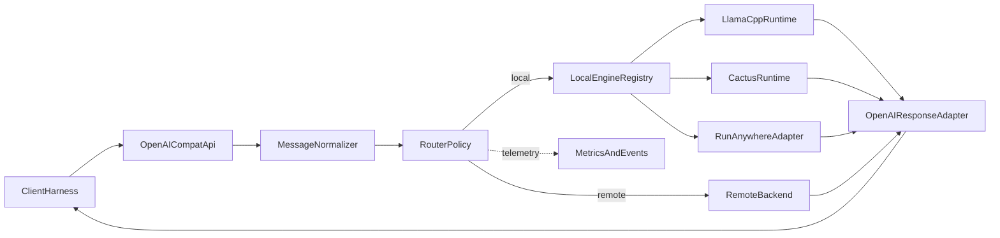

# Seceda OpenAI-Compatible Migration

## Goal

Make `[seceda_edge/cpp/apps/seceda_edge_daemon/main.cpp](seceda_edge/cpp/apps/seceda_edge_daemon/main.cpp)` serve as the primary OpenAI-compatible edge endpoint, so OpenCode, Cursor, and other OpenAI-compatible harnesses can call Seceda directly over localhost. Keep Seceda’s real value at the execution layer: local-first routing, fallback, model lifecycle, observability, and support for multiple local inference engines rather than a permanently `llama.cpp`-specific stack.

## Target Shape




## Phase 1 Decisions

- Public inference API becomes OpenAI-compatible first: `POST /v1/chat/completions`, `GET /v1/models`, and SSE streaming.
- Phase 1 is optimized for compatibility with code execution harnesses, not for Seceda-owned tool execution loops.
- Treat the current `POST /inference` contract as a migration-only bridge that must be removed after OpenAI chat plus observability parity is in place.
- Prefer OpenAI request shapes as the canonical internal format for inference, with Seceda-specific metadata layered on top rather than inventing a fully separate request schema.
- Default to no auth on localhost in phase 1; do not require bearer auth for local development by default.
- Keep phase 1 routing simple: current local path plus one configured remote backend (Modal first), but design config and response metadata so both multiple local engines and named remote backends/model aliases can be added later.
- Keep `llama.cpp` as the first local engine implementation if needed, but remove assumptions that “local” always means one GGUF-backed in-process runtime.
- Design for three local adapter shapes from the start:
  - native linked runtimes such as `llama.cpp`
  - local service or SDK bridges such as future Cactus or RunAnywhere adapters
  - separate local servers such as `llama.cpp` server or other localhost OpenAI-compatible services
- Accept advanced OpenAI request fields such as `tools`, `tool_choice`, and structured-output hints only as preserved pass-through when the selected backend can honor them; Seceda itself does not execute tools in phase 1.
- Make `/v1/models` return the configured Seceda-exposed model aliases or identities, not a live merged discovery catalog from all possible backends.
- Accept common OpenAI field aliases where cheap and low-risk, especially `max_tokens` and `max_completion_tokens`, rather than chasing full API parity.
- Keep configuration file / env / CLI driven for now; postpone a richer TUI/control plane until the internal backend model stabilizes.

## Phase 1 Compatibility Contract

- Supported endpoints:
  - `POST /v1/chat/completions`
  - `GET /v1/models`
- Supported response modes:
  - non-streaming chat completions
  - SSE streaming chat completions
- Supported input baseline:
  - text chat messages
  - common generation controls and common token-limit aliases
- Accepted as pass-through only:
  - `tools`
  - `tool_choice`
  - structured-output or response-format hints
- Explicitly not executed by Seceda in phase 1:
  - tool execution loops
  - remote backend discovery or backend-native control planes
- Unsupported or intentionally deferred in phase 1:
  - full multimodal parity across local engines
  - broad OpenAI API surface beyond chat-completions and models
  - full Responses API compatibility
- Error behavior:
  - unsupported or unhonorable features should return clear OpenAI-style error payloads rather than silently stripping behavior

## Phase 1 Delivery Slices

- Slice 1:
  - define the wire contract, `/v1/models` semantics, localhost auth posture, and OpenAI-style error mapping
  - add early HTTP golden fixtures for request and response shapes
- Slice 2:
  - ship core `chat.completions` compatibility for non-streaming requests
  - keep routing behavior and current local or remote functionality intact
- Slice 3:
  - add SSE streaming with explicit chunking, cancellation, fallback, and metadata rules
- Slice 4:
  - move fully to the OpenAI-shaped internal envelope and thin Seceda metadata layer
- Slice 5:
  - introduce the local engine registry, engine identities, and future-facing backend/model identity support

These slices are for reviewability and testability. They do not forbid a larger internal rewrite, but they define the user-visible checkpoints the migration should preserve.

## Reuse These Existing Seams

The current runtime already separates decision, local execution, and remote execution in `[seceda_edge/cpp/src/runtime/interfaces.hpp](seceda_edge/cpp/src/runtime/interfaces.hpp)`:

```cpp
virtual LocalCompletionResult generate(const InferenceRequest & request) = 0;
virtual CloudCompletionResult complete(const InferenceRequest & request) = 0;
virtual RouteDecision decide(const InferenceRequest & request) const = 0;
```

That means the migration does not need to begin with a full execution rewrite. Start by using the existing runtime seams where they accelerate progress, but allow broader refactors or replacements when they clearly simplify the architecture, preserve current functionality, and better support the OpenAI-compatible, multi-engine direction. The current `ILocalModelRuntime` seam is the right starting point, but it should grow from “the one local runtime” into an engine adapter that can sit behind a registry or resolver.

## Work Plan

### 1. Define the phase 1 OpenAI contract explicitly

- Keep `[seceda_edge/cpp/apps/seceda_edge_daemon/main.cpp](seceda_edge/cpp/apps/seceda_edge_daemon/main.cpp)` as the daemon entrypoint, but move request/response mapping into a new transport area such as `seceda_edge/cpp/src/openai_compat/`.
- Add request parsing and response rendering for:
  - `POST /v1/chat/completions`
  - `GET /v1/models`
- Document phase 1 request and response behavior for:
  - auth posture on localhost
  - OpenAI-style error payloads and HTTP status mapping
  - common request aliases such as `max_tokens` and `max_completion_tokens`
  - pass-through-only handling of `tools`, `tool_choice`, and structured-output hints
- Define `/v1/models` as a config-backed list of Seceda-exposed identities rather than dynamic backend discovery.
- Keep `/health`, `/info`, `/metrics`, and `/metrics/events` intact because they are part of Seceda’s operational value, not the client-facing inference contract.
- Add HTTP-level golden fixtures early so request and response compatibility is verified before deeper executor refactors.

### 2. Treat SSE streaming as a separate compatibility track

- Specify SSE chunk framing and termination rules independently from non-streaming responses.
- Define how cancellation, local-to-remote fallback, and error propagation behave once streaming has started.
- Decide where Seceda-native metadata belongs during streaming:
  - logs and metrics only
  - final chunk metadata only
  - no extra wire metadata in phase 1 unless clearly OpenAI-compatible
- Add dedicated streaming fixtures and integration coverage rather than bundling SSE under the base chat endpoint task.

### 3. Use an OpenAI-shaped internal envelope with a thin Seceda normalization layer

- Evolve `[seceda_edge/cpp/src/runtime/contracts.hpp](seceda_edge/cpp/src/runtime/contracts.hpp)` away from the current bespoke `text` plus `system_prompt` shape and toward a canonical OpenAI-style chat request envelope.
- Keep the normalization layer intentionally thin:
  - validate and apply defaults
  - canonicalize options used by executors
  - extract routing-friendly summaries from `messages`, tools, and response-format hints
  - attach Seceda-specific context without forking the base OpenAI structure
- Add a small Seceda metadata or request-context extension for fields that do not belong in the public OpenAI contract, such as route preferences, privacy hints, preferred engine/backend, or internal tracing context.
- Update `[seceda_edge/cpp/src/local_models/llama_runtime.cpp](seceda_edge/cpp/src/local_models/llama_runtime.cpp)` and `[seceda_edge/cpp/src/cloud_bridge/cloud_client.cpp](seceda_edge/cpp/src/cloud_bridge/cloud_client.cpp)` to consume the normalized request shape rather than depending on a transport-specific shortcut.
- Preserve the current `route_reason`, `matched_rules`, timing, and fallback fields in the internal response so the OpenAI surface can remain thin while Seceda keeps richer introspection.

### 4. Generalize local execution from one runtime to a local engine registry

- Replace direct single-runtime wiring in `[seceda_edge/cpp/src/runtime/edge_daemon.cpp](seceda_edge/cpp/src/runtime/edge_daemon.cpp)` and `[seceda_edge/cpp/src/runtime/request_executor.cpp](seceda_edge/cpp/src/runtime/request_executor.cpp)` with a local engine resolver or registry that can select the configured engine adapter.
- Extend `[seceda_edge/cpp/src/runtime/contracts.hpp](seceda_edge/cpp/src/runtime/contracts.hpp)` so local model config and info include stable identity beyond `active_model_path`, such as:
  - `engine_id`
  - `model_id` or `model_alias`
  - `display_name`
  - `capabilities`
  - `execution_mode` such as `in_process`, `sdk_bridge`, or `sidecar_server`
- Keep `[seceda_edge/cpp/src/local_models/llama_runtime.hpp](seceda_edge/cpp/src/local_models/llama_runtime.hpp)` and `[seceda_edge/cpp/src/local_models/llama_runtime.cpp](seceda_edge/cpp/src/local_models/llama_runtime.cpp)` as the first adapter pair, but design the directory and wiring so future adapters like `CactusRuntime` or `RunAnywhereAdapter` are first-class additions rather than special cases.
- Treat localhost model servers as first-class local adapters too, so Seceda can route to an already-running `llama-server` or similar local daemon without forcing every engine into the same embedding model.
- Separate engine selection from model selection so future routing can choose the best local engine/model pair instead of treating “local” as one monolith.

### 5. Separate routing target identity from the old `local` / `cloud` binary

- Keep the phase 1 behavior simple in `[seceda_edge/cpp/src/runtime/request_executor.cpp](seceda_edge/cpp/src/runtime/request_executor.cpp)`: preferred local engine first unless policy says remote.
- Introduce fields in contracts/config for `engine_id`, `backend_id`, and `model_alias` even if phase 1 only has:
  - `local/llama.cpp/default`
  - `remote/modal-default`
- Extend `[seceda_edge/cpp/src/runtime/contracts.hpp](seceda_edge/cpp/src/runtime/contracts.hpp)` and `[seceda_edge/cpp/src/runtime/runtime_config.cpp](seceda_edge/cpp/src/runtime/runtime_config.cpp)` so the remote backend is described as a named backend configuration rather than a one-off cloud block only.
- Preserve today’s `RouteTarget` for compatibility in phase 1, but make the executor/results record the resolved backend/model identity so phase 2 can graduate to true hierarchical routing without another transport rewrite.

### 6. Keep the router simple now, but plan the next abstraction correctly

- Keep `[seceda_edge/cpp/src/router/heuristic_router.cpp](seceda_edge/cpp/src/router/heuristic_router.cpp)` as the phase 1 policy engine, but feed it normalized user-visible content instead of raw `text` from the old Seceda API.
- Add a new routing result concept that can eventually express:
  - preferred execution tier
  - preferred local engine id
  - resolved backend id
  - resolved model alias
  - fallback chain
- Do not implement the full backend registry logic yet; instead, make the interfaces and telemetry capable of carrying this information so future work can add OpenRouter endpoints, `openrouter/auto`, multiple Modal backends, and multiple local engine families cleanly.
- Centralize routing-signal extraction in the thin normalization layer so routers do not need to repeatedly parse full OpenAI message arrays.

### 7. Preserve and extend Seceda’s observability through the migration

- Keep `[seceda_edge/cpp/src/telemetry/metrics_registry.cpp](seceda_edge/cpp/src/telemetry/metrics_registry.cpp)` and the event log contract exposed in `[seceda_edge/cpp/apps/seceda_edge_daemon/main.cpp](seceda_edge/cpp/apps/seceda_edge_daemon/main.cpp)`.
- Extend event and metric payloads to include resolved engine/backend/model identity, not just `local` vs `cloud`.
- Ensure OpenAI-compatible requests still produce Seceda-native routing/fallback telemetry so the migration strengthens the product story rather than hiding it.

### 8. State explicit non-goals for phase 1

- Do not treat phase 1 as a mandate to support the full OpenAI API surface.
- Do not build a full backend registry UI, TUI, or remote discovery system before the public inference contract stabilizes.
- Do not promise multimodal parity across all local engine types in phase 1.
- Do not promise Seceda-managed tool execution loops in phase 1; advanced fields are preserved only when capable backends can honor them.
- Do not add Responses API compatibility in phase 1 unless it becomes necessary for a specific target harness.

### 9. Deprecate the Seceda-specific inference API and move examples to OpenAI clients

- Update `[README.md](README.md)` to position Seceda as an OpenAI-compatible local edge service.
- Replace `curl ... /inference` examples with OpenAI-compatible examples for localhost clients and add `request_id`-based observability lookups.
- Document the local engine architecture explicitly, with `llama.cpp` as the initial adapter and Cactus / RunAnywhere as planned adapter classes with different integration shapes.
- End the migration by deleting `/inference` once `GET /v1/models`, `POST /v1/chat/completions`, and `GET /metrics/events?request_id=<openai_id>` cover the operator and TUI workflows.
- Add smoke tests or integration tests for the HTTP layer, since today the runtime is tested more than the route table and OpenAI wire compatibility.

## File Focus

- `[seceda_edge/cpp/apps/seceda_edge_daemon/main.cpp](seceda_edge/cpp/apps/seceda_edge_daemon/main.cpp)`
- `[seceda_edge/cpp/src/runtime/contracts.hpp](seceda_edge/cpp/src/runtime/contracts.hpp)`
- `[seceda_edge/cpp/src/runtime/interfaces.hpp](seceda_edge/cpp/src/runtime/interfaces.hpp)`
- `[seceda_edge/cpp/src/runtime/edge_daemon.cpp](seceda_edge/cpp/src/runtime/edge_daemon.cpp)`
- `[seceda_edge/cpp/src/runtime/request_executor.cpp](seceda_edge/cpp/src/runtime/request_executor.cpp)`
- `[seceda_edge/cpp/src/runtime/runtime_config.cpp](seceda_edge/cpp/src/runtime/runtime_config.cpp)`
- `[seceda_edge/cpp/src/cloud_bridge/cloud_client.cpp](seceda_edge/cpp/src/cloud_bridge/cloud_client.cpp)`
- `[seceda_edge/cpp/src/local_models/llama_runtime.hpp](seceda_edge/cpp/src/local_models/llama_runtime.hpp)`
- `[seceda_edge/cpp/src/local_models/llama_runtime.cpp](seceda_edge/cpp/src/local_models/llama_runtime.cpp)`
- `[seceda_edge/cpp/src/router/heuristic_router.cpp](seceda_edge/cpp/src/router/heuristic_router.cpp)`
- `[seceda_edge/cpp/src/telemetry/metrics_registry.cpp](seceda_edge/cpp/src/telemetry/metrics_registry.cpp)`
- `[README.md](README.md)`

## Guardrails For The Migration

- Prefer targeted refactors when they reduce migration risk, but allow large deletions or rewrites when they materially simplify the architecture, preserve existing functionality, and keep OpenAI compatibility, routing quality, and multi-engine local execution as the top priorities.
- Do not invent a heavily bespoke internal request schema unless a concrete executor or routing need cannot be expressed with an OpenAI-shaped envelope plus Seceda metadata.
- Do not equate `local` with `llama.cpp` in config names, response metadata, metrics, or routing contracts.
- Do not assume every local engine is embedded the same way; support native runtimes, sidecar/local servers, and SDK bridges as distinct adapter styles.
- Do not lock phase 1 config into a Modal-only worldview; use a named remote backend shape even if only one backend is initially supported.
- Do not silently drop unsupported advanced request behavior; either preserve and forward it to a capable backend or return a clear OpenAI-style error.
- Avoid a least-common-denominator local engine abstraction that would block capabilities like streaming, tools, structured output, or multimodal inputs later.
- Keep Seceda-specific telemetry richer than the public OpenAI response shape.
- Treat TUI/control-plane work as follow-on once the backend registry and public API contract are stable.

